<div align="center">

# ⚡ WorldC2

### Command & Control platform for authorized security labs

[](https://golang.org/)
[](https://vuejs.org/)
[](LICENSE)
[](.github/workflows/ci.yml)
[]()

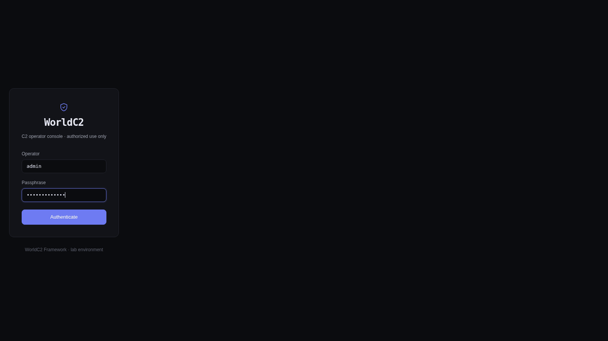

</div>

---

## ⚠️ Authorized use only

WorldC2 is a **red-team tooling project built for learning and demonstration**. It is intended for
use in environments you own or are explicitly authorized to test (CTF labs, home labs, engagements
with a signed scope). Unauthorized use against systems you do not own is illegal.

This project is published as a **portfolio piece**: it shows how a modern C2 is architected in Go —
encrypted transports, session management, RBAC, audit logging and a real-time operator console.

---

## ✨ What it actually does

| Feature | Status | Notes |
|---------|--------|-------|
| 🔐 Encrypted C2 channel | ✅ Working | X25519 key exchange + XChaCha20-Poly1305 (AEAD) per session |
| 📡 Multi-transport listeners | ✅ Working | TCP+TLS, HTTP long-poll, WebSocket, WebRTC and DNS (opt-in) — all five reachable from the agent's fallback chain, the HTTP transport covered by a loopback framing test |
| 🖥️ Operator web console | ✅ Working | Vue 3 + Vite, dark minimalist UI, live polling |
| 🧩 REST API + JWT auth | ✅ Working | Access + refresh tokens (`token_use` claims), bcrypt operators |
| 👥 RBAC | ✅ Working | `admin` / `operator` / `viewer` / `auditor` roles, per-endpoint permissions |
| 📜 Audit log | ✅ Working | Actions stored in SQLite, SIEM forwarding hook |
| 🔌 Modular task system | ✅ Working | Protobuf envelopes, dynamic module push; manifests HMAC-signed on registration and re-verified before every push (tampered manifests rejected) |
| 🎛️ Agent profiles | ✅ Working | Beacon cadence / jitter / transport presets with server-side validation (name, interval, jitter ranges and a transport allowlist) and honest 404 deletes (`GET/POST /api/profiles`, `DELETE /api/profiles/:id`); managed from the console Profiles view |
| 📁 Loot storage | ✅ Working | Session-scoped file storage with traversal protection; listing persisted in SQLite (`file_records`) and re-hydrated on restart, downloads keep working across restarts; individual artifacts or the whole loot board can be purged from the console (`DELETE /api/files/:id` and `DELETE /api/files`, `files:delete`) |
| 🌐 SOCKS5 / port-forward tunnels | ✅ Working | TCP relaying through agents |
| 🗄️ SQLite storage | ✅ Working | Transactional migrations; optional AES-256-GCM at-rest encryption for secrets (`WORLDC2_MASTER_KEY`) with PBKDF2-stretched key + per-DB salt (legacy ciphertext still readable) |
| 🐳 Docker packaging | ✅ Working | Multi-stage build, non-root runtime user, healthcheck |
| 🔄 DNS transport | ✅ Working | TXT tunneling integrated in the agent fallback chain (opt-in: `worldc2-agent -dns-domain your.domain`) |
| 🕸️ WebRTC transport | ✅ Working | Pion data channels with HTTP signaling (port 8447), detached channel adapted as `net.Conn`; covered by a loopback roundtrip test |
| 📈 Resumable file exfil | ✅ Working | `exfil:<path>` streams chunked uploads; server reassembles, survives reconnects/restarts and resumes from the exact byte via `__exfil_resume` tasks |
| 🎛️ Agent profiles | ✅ Working | Beacon cadence / jitter / transport presets with server-side validation (name, interval, jitter ranges and a transport allowlist) and honest 404 deletes (`GET/POST /api/profiles`, `DELETE /api/profiles/:id`); managed from the console Profiles view |
| 🗝️ Credential vault console | ✅ Working | Dedicated **Vault view** (round 15): search as you type (`GET /api/vault?q=`, capped at 256 chars), add with API-mirrored field caps, password reveal toggles and admin-only deletes (`DELETE /api/vault?id=`, `vault:delete`) — IDs are crypto/rand, not time-derived |
| 🔔 SIEM webhooks | ✅ Working | `POST/GET/DELETE /api/webhooks` (admin); destinations are **persisted** (migration 9) and re-hydrated on server start; creation validates URL length, header caps (the form supports **multiple** custom headers), a real forwarding timeout (100–60000 ms) and the event-type allowlist; the listing carries a **per-destination delivery ledger** (`stats`: delivered/failed/last_delivery/last_status) surfaced as badges in the console Webhooks view |
| 📈 Engagement report | ✅ Working | `GET /api/report?format=text|csv|json&days=1..90` (`report:generate`) compiles sessions, tasks and loot into a report — `&download=1` serves the report **content** as an attachment (the Dashboard button ships a format selector plus a **days window** that genuinely filters rows); unknown formats and out-of-range windows answer 400 |
| 📊 Prometheus metrics | ✅ Working | `GET /api/metrics` (`sessions:list`, round 16) exposes operational gauges in the **Prometheus text format**: build identity (`worldc2_build_info` with version/commit/go_version labels, round 17), sessions active/total, tasks, vault count, loot count, webhook delivery ledger, listeners, uptime, Go runtime — counts only, never credential material or session identifiers |
| ⏱️ Time-window filters | ✅ Working | `GET /api/sessions?days=1..90` and `GET /api/files?days=1..90` (round 16) narrow listings to the window with the same strict shared parser as the report; the console Sessions and Files views expose it as an "All time / 24h / 7d / 30d / 90d" select and the default (no parameter) behavior is unchanged |
| 🧾 Vault CSV export | ✅ Working | The Vault view exports the current listing (search filter included) to `worldc2-vault-YYYY-MM-DD.csv` (round 16) — built client-side with RFC 4180 quoting and a **formula-injection guard** (`=`, `+`, `-`, `@` and tab-led cells are neutralized) because captured values come from untrusted hosts |
| 🗂️ Files CSV export | ✅ Working | The Files view exports the current filtered listing to `worldc2-files-YYYY-MM-DD.csv` (round 17) through the same guarded serializer — filename, session, module, size and capture date, exactly the rows the operator sees |
| 🛡️ Two-step confirmations | ✅ Working | A shared `ConfirmModal` (round 16) replaces `window.confirm` for vault deletes and session kill/purge: styled explainer, Esc/backdrop always cancels, focus starts on the safe control, and the destructive **purge** additionally requires typing `PURGE`. Round 17 adopts it in Files too — single purge, selected purge and the bulk **Purge all** (phrase required) |
| 📜 Audit log viewer | ✅ Working | `GET /api/audit` (gated by the `audit:read` permission — admin **and auditor** roles, round 17) exposes the append-only `audit_log` trail — every API call, auth event and lifecycle action has been recorded there since round 1 — with `?limit=1..500` and `?action=` filters; the console gains an **Audit log** view (admin & auditor) with search, action filter and live refresh |
| 📑 Task history pagination | ✅ Working | `GET /api/sessions/{id}` pages the task history with an opaque composite cursor (`?limit=1..200`, `?before=&before_id=`, round 17) instead of silently capping at 100 rows; the session detail panel shows a **Load more** control and the default page keeps the historical behavior |
| 🖥️ SIEM webhook health on the Dashboard | ✅ Working | Admins see a per-destination delivery panel (ok/failed counters, last attempt and status from the round-15 ledger) right on the Dashboard (round 17); other roles never hit the admin-gated endpoint |
| 🏷️ Build identity | ✅ Working | `make build-server` injects version and commit via `-ldflags` (round 17); the identity shows up in `worldc2_build_info` and CI stamps it per build |
| 🤖 CI with browser E2E | ✅ Working | `.github/workflows/ci.yml` runs the Go `-race` suite, the web build, cross-platform builds, Docker smoke, security gates **and the Playwright browser E2E against a real server** (round 17) under workflow-level least-privilege `permissions: contents: read` |
| 🖱️ Browser E2E suite | ✅ Working | `tests/e2e/` (round 16): a Playwright suite that drives the real console — login, dashboard, sessions filters, vault create/search/CSV-export/two-step-delete and logout — runnable via `make test-e2e` against any running server (`E2E_BASE_URL`, `E2E_USER`, `E2E_PASS`); the auth-setup project persists the operator session to `.auth/operator.json` (gitignored). Round 17 adds audit-view, Files-export and webhook-panel specs; round 18 adds command-palette, operator-attribution and webhook-test specs; round 19 adds the MFA enrollment + two-step login, password-revocation and cursor/CSV specs (**14 tests**) and the suite is self-cleaning (re-runnable against a persistent dev server) |
| ⌨️ Command palette | ✅ Working | `Ctrl+K` / `Cmd+K` (round 18) opens a jump-to palette in the console: fuzzy filter across every view the current role may open (mirrors the route guards) plus quick actions — arrow keys navigate, `↵` opens, `Esc` closes; also clickable from the topbar hint |
| 👤 Audit attribution by operator | ✅ Working | Every authenticated API call writes its **real operator id** to the trail (round 18 — previously the column stayed at 0 and the actor only lived in free text), so `GET /api/audit?user=NAME` answers "what did THIS account do" as a query; unknown users answer an empty array (no existence oracle) and the console Audit view gains an **Operator column** plus a server-side operator filter |
| 🧹 Audit retention policy | ✅ Working | `audit.retention_days` (round 18) prunes trail rows older than the window at startup and hourly — the one, product-level delete path on the append-only log; `worldc2_audit_entries` / `worldc2_audit_pruned_total` gauges make growth and pruning observable; `0` (default) keeps the trail forever |
| 📮 Webhook test delivery | ✅ Working | `POST /api/webhooks/test?id=` (admin, round 18) fires **one synthetic event synchronously** and answers `{"delivered": true|false}` honestly — a dead endpoint is a 200 with the transport error, not a disguised 500; the attempt folds into the same delivery ledger, and the console Webhooks view gains a send-to-test button per destination |
| 🔢 TOTP two-factor auth | ✅ Working | Opt-in MFA per operator (round 19): `POST /api/account/totp/setup` generates a 160-bit secret (crypto/rand, stored **encrypted** with the column encryptor when `WORLDC2_MASTER_KEY` is set) and returns it once with the `otpauth://` URI; `POST /api/account/totp/enable` requires a valid code to confirm (RFC 6238, SHA-1, 30 s, ±1 step skew, **constant-time** `hmac.Equal` compare — stdlib only, zero new dependencies). A correct password without a code answers `401 {totp_required:true}` and never counts as an auth failure; a wrong code answers the generic 401 and **does** count toward the lockout. Disabling requires the current code; admins can reset a lost authenticator via `DELETE /api/operators/{id}/totp` (audited, secret never revealed) |
| 🔁 Self-service password change | ✅ Working | `POST /api/account/password` (round 19): verifies the CURRENT password through the same bcrypt + lockout path as login, enforces a 10–128 char floor, refuses no-op rotations, then **revokes every outstanding token** (access + refresh, ms-precision cut) — the only safe session after a credential change is a fresh one; the console gains an Account-security panel (click your operator chip) |
| 🔒 Account lockout | ✅ Working | 5 consecutive failed logins (password or TOTP stage) trip a per-account wall stored in the DB — it survives restarts and cannot be out-run by distributed guessing; the lock auto-expires after 5 minutes (no permanent-DoS design) and clears on success. Locked accounts answer the **same generic `invalid credentials`** as wrong passwords — no username or lock-state oracle — while the audit trail records `auth_locked` separately |
| 🩺 Account hygiene in the Operators view | ✅ Working | The admin's account listing gains MFA badges (enrollment status — never the secret) and a per-account audit summary: **last activity**, events in the last 30 days and last login, sourced from the round-18 `operator_id` attribution with one aggregated query; dormant accounts are visible at a glance |
| 📑 Audit cursor pagination & CSV | ✅ Working | `GET /api/audit?before_id=N` (round 19) walks the trail deeper than the 500-row page with a plain-integer cursor (monotonic id — no timestamp traps), composing with `?action=` and `?user=`; the Audit view gains **Load more** and **Export CSV** through the shared formula-guarded serializer |
| 🩺 Server identity in the console | ✅ Working | `/api/status` (round 19) now reports build identity (`version`/`commit`/`go_version`), `db_ok` liveness and sanity counts; the topbar renders the version chip on a 60 s cadence |
| 😴 Idle auto-logout | ✅ Working | 15 minutes without user interaction closes the console session (round 19, client-side — the JWT TTL stays the hard server-side limit); the login screen explains the re-auth with an idle notice |

> **Honesty policy:** this README only claims what the code does. Features that are planned or
> experimental are marked as such — see the [CHANGELOG](CHANGELOG.md) for history.
>
> **Known gaps (round 3 audit):**
> - The HTTP long-poll transport (port 8445) was **repaired in round 2** and is now part of the
>   agent fallback chain (`TLS → TCP → HTTP → WebSocket → WebRTC → DNS`); it carries the same
>   length-prefixed envelope framing over `POST /register` (agent→server) and `POST /poll`
>   (long-poll, server→agent). Covered by loopback tests, including concurrent read/write and
>   multi-megabyte frames. The fallback ports are overridable without recompiling via
>   `-http-port` / `-ws-port` / `-webrtc-port` / `-dns-port` (round 3).
> - The agent **auto-installs persistence** on first run (cron/bashrc, registry/schtasks,
>   LaunchAgent depending on OS); in authorized labs run it with `-no-persist` to disable that
>   behavior.
> - Anti-replay by envelope sequence number remains an open item tracked in the agent reports
>   (it needs a proto regeneration). Refresh-token rotation with replay denial shipped in
>   round 10; round 12 additionally rejects pre-rotation no-jti refresh tokens outright
>   (they cannot be tracked for one-time use). Round 3 closed the tunnel/exfil reaper gap
>   (tunnels now tear down on session close and are reaped after 15 min idle) and upgraded the at-rest KDF:
>   with `WORLDC2_MASTER_KEY` set, new writes use PBKDF2-HMAC-SHA256 (600 000 iterations,
>   per-database salt in `_kdf_meta`). Round 4 also re-encrypts legacy (pre-v2) column values
>   to the stretched format on startup, so encrypted databases converge to a single generation.

---

## 🎬 See it in action

All three demos are captured from a real server with a real agent connected — no mocks.

| Operator tour | Live command execution | Command palette (Ctrl+K) |
|---------------|-------------------------|--------------------------|
|  | 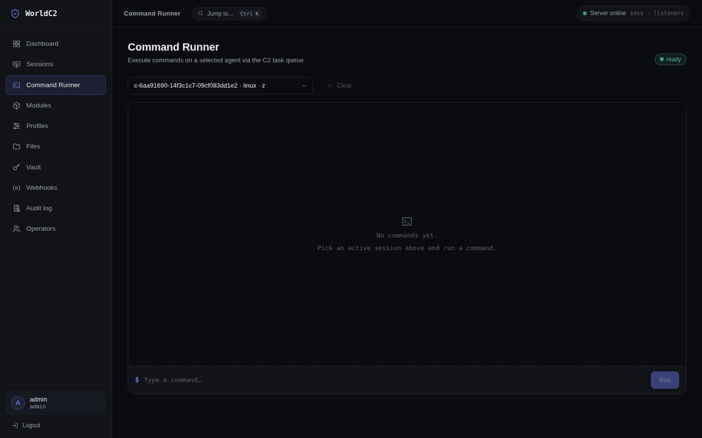 | 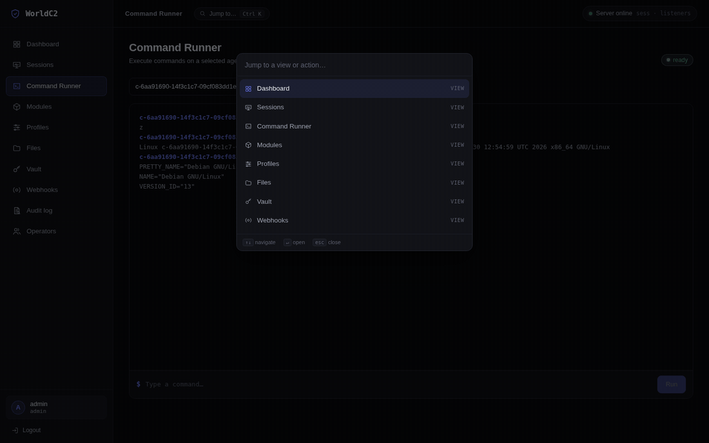 |

---

## 📸 Console

Every screenshot is re-captured from a live server on each documentation round.

| Login | Dashboard |
|-------|-----------|
| 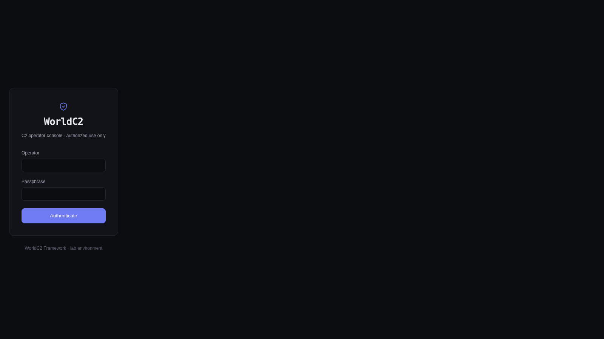 | 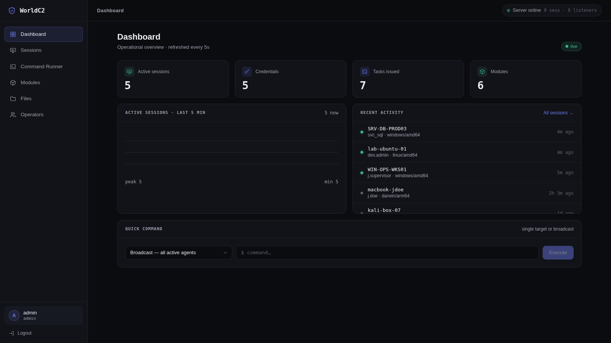 |

| Sessions (task history) | Command Runner |
|----------|----------------|
| 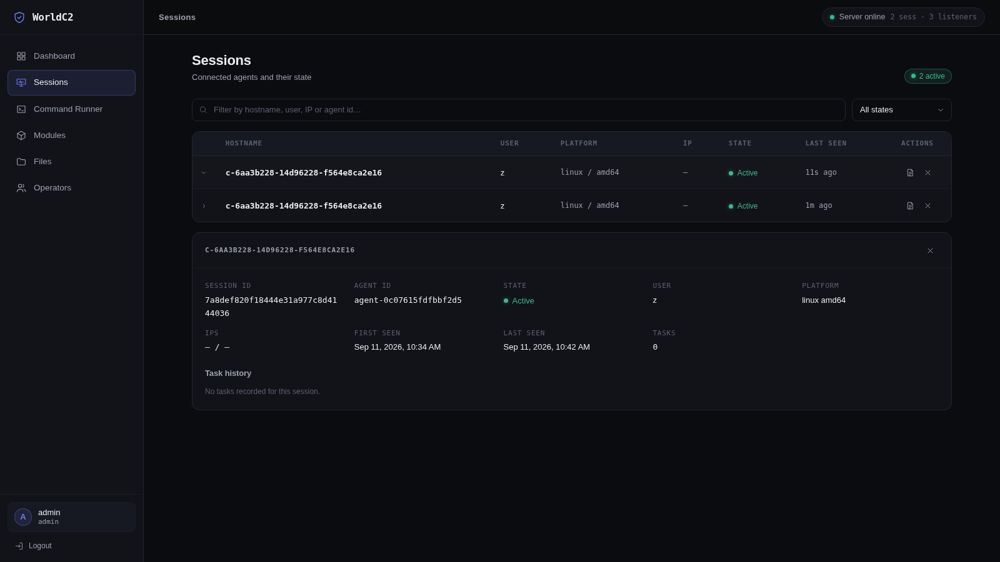 | 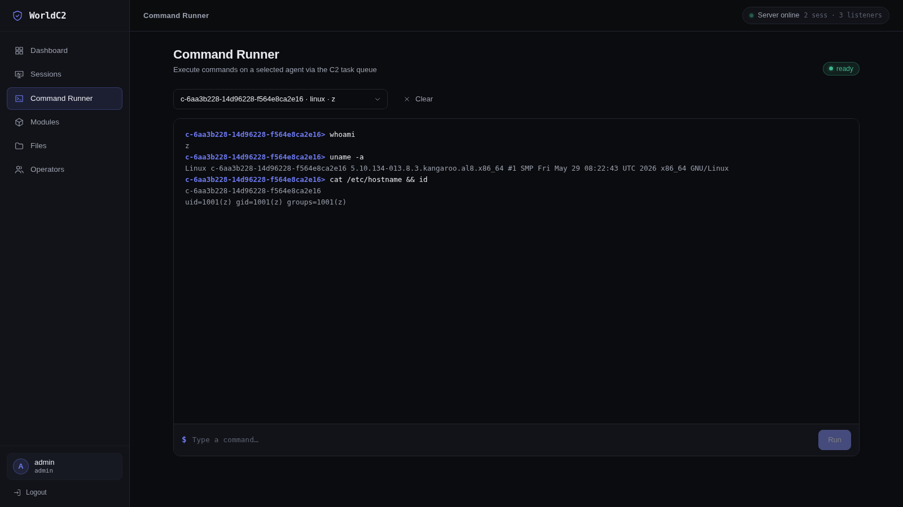 |

| Modules | Files |
|---------|-------|
| 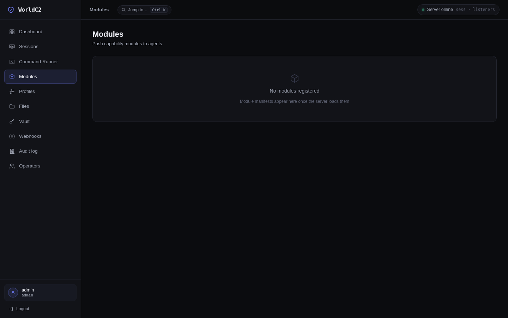 | 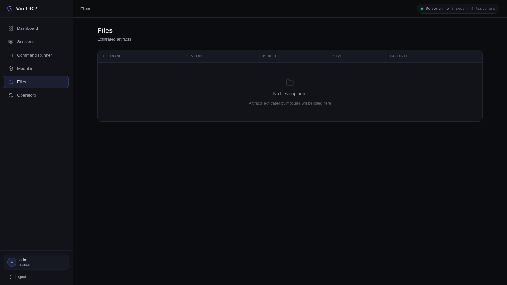 |

| Profiles | Webhooks (SIEM) |
|----------|------------------|
| 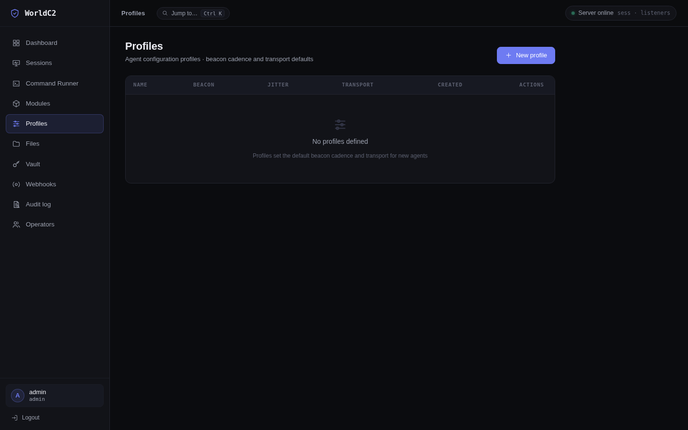 | 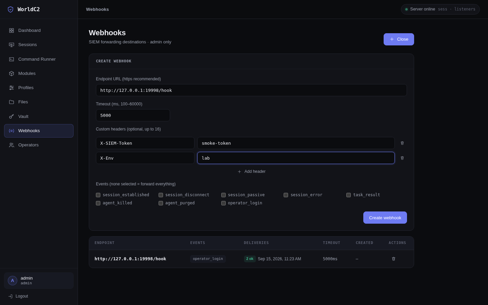 |

| Credential Vault | Audit log (operator attribution) |
|------------------|-----------------------------------|
| 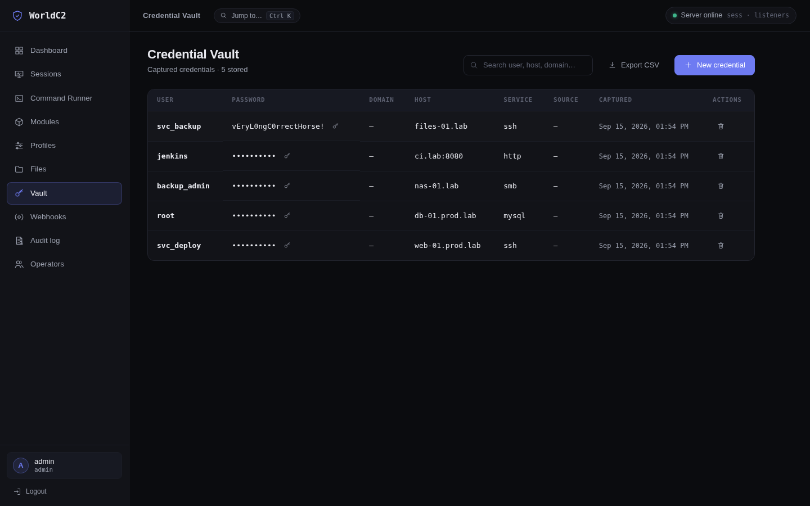 | 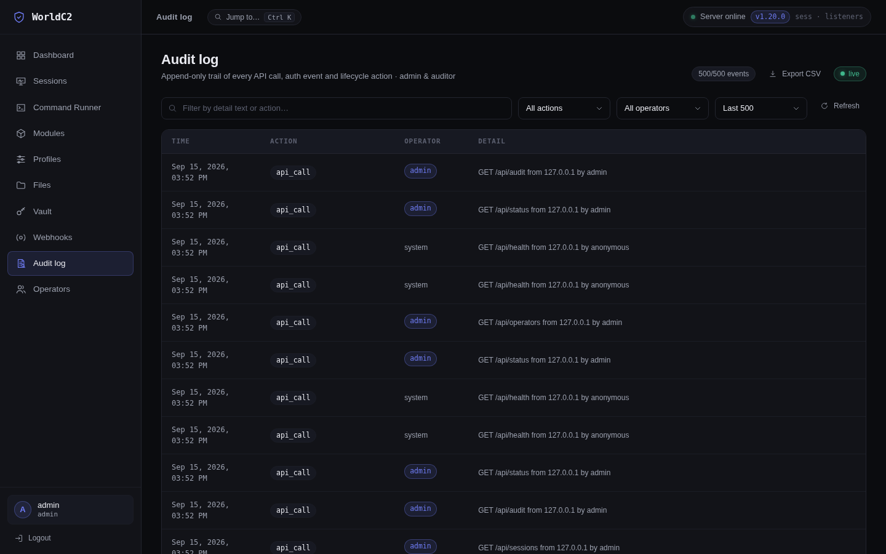 |

| Operators |
|-----------|
| 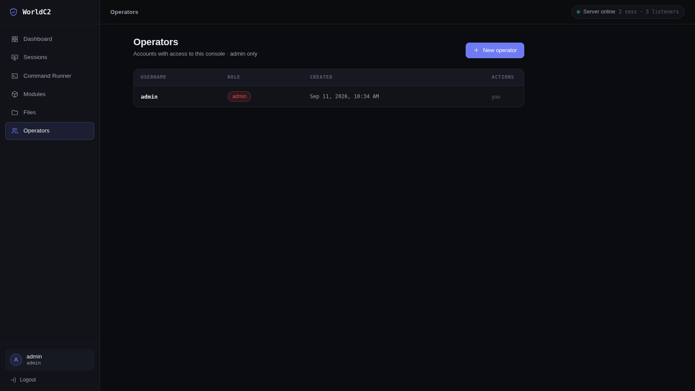 |

---

## 🏗️ Architecture

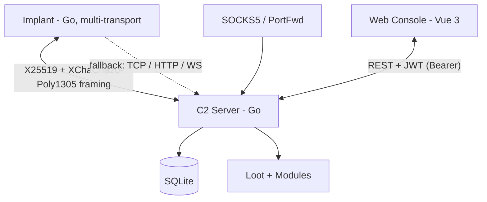
```mermaid
graph TB
    Agent[Implant - Go, multi-transport]
    Server[C2 Server - Go]
    Proxy[SOCKS5 / PortFwd]
    UI[Web Console - Vue 3]
    DB[(SQLite)]
    Loot[Loot + Modules]

    Agent <-->|"X25519 + XChaCha20-Poly1305 framing"| Server
    Agent -.->|"fallback: TCP / HTTP / WS"| Server
    Proxy --> Server
    UI <-->|"REST + JWT (Bearer)"| Server
    Server --> DB
    Server --> Loot
```

**Crypto:** every session runs an ephemeral X25519 agreement; HKDF-SHA256 derives the encryption
key, an HMAC key and a session token; traffic is framed as protobuf envelopes encrypted with
XChaCha20-Poly1305 (192-bit nonces). The API layer is separate: bcrypt-hashed operators, JWT access
tokens (12h) + refresh tokens (24h, `token_use=refresh`, rejected by API routes), and RBAC checks
per endpoint.

---

## 🚀 Quick start

```bash
git clone https://github.com/Ruby570bocadito/WorldC2.git
cd WorldC2

# Build the server (Go 1.25+)
cd src/go && go build -o ../../dist/worldc2-server ./cmd/server && cd ../..

# Build the web console (Node 18+)
cd web && npm ci && npm run build && cd ../..

# Configure
cp config.example.yaml config.yaml
#   → default example hash is 'admin': CHANGE IT before any real use
#   → or remove the operators block and a random bootstrap password is printed once

# Run — the console is served on the API port automatically
./dist/worldc2-server -config config.yaml
# Dashboard:  http://localhost:9090
# Health:     http://localhost:9090/api/health   (liveness only, public)
# Status:     http://localhost:9090/api/status   (telemetry, Bearer required)
```

### Docker

```bash
docker compose up --build      # or: docker build -t worldc2-server .
```

### Agents

```bash
cd src/go
go build -o ../../dist/worldc2-agent ./cmd/agent
./dist/worldc2-agent --server 127.0.0.1:8443
# For authorized labs, disable first-run auto-persistence:
./dist/worldc2-agent --server 127.0.0.1:8443 -no-persist
```

---

## 🔧 Development

```bash
make test          # Go tests with race detector
make lint          # go vet
make web           # build frontend
make build-agent-all  # cross-compile agents
make test-all      # Go + Python + frontend pipeline
make test-e2e      # Playwright console suite (needs a running server;
                   # E2E_BASE_URL / E2E_USER / E2E_PASS override defaults)
```

CI runs on every push: Go tests (`-race`), vet, gofmt, Python syntax checks, a live API smoke test
against a real server instance, frontend build with XSS-sink checks, multi-platform builds and a
Docker smoke test.

---

## 📦 Project layout

```
WorldC2/
├── src/go/               # Go workspace
│   ├── cmd/server        #   C2 server entrypoint
│   ├── cmd/agent         #   implant entrypoint
│   ├── cmd/builder       #   payload builder helper
│   └── internal/         #   c2, session, crypto, auth, db, handlers, module, transport...
├── web/                  # Vue 3 + Vite operator console
├── api/openapi.yaml      # REST API spec
├── modules/              # dynamic module manifests
├── scripts/              # operator tooling (deploy, certs, hardening audit, console client)
├── tests/                # API functional / e2e / pentest self-tests
├── docs/assets/          # screenshots & demo GIF
└── Makefile
```

---

## 🔒 Security notes

- Operators are stored as bcrypt hashes; the example config ships the hash of `admin` — change it.
- TLS: `auto_cert: true` generates a self-signed cert; point `cert_file`/`key_file` at your own
  cert for real deployments. If TLS is enabled but misconfigured, **the server refuses to start**
  instead of falling back to plaintext.
- Agents pin the server certificate on first connect (TOFU) and reject changes afterwards.
- Optional mutual TLS: set `tls.mtls: true`, issue a client certificate
  (`POST /api/mtls/cert`, admin) and start the agent with `worldc2-agent -tls-cert agent.crt -tls-key agent.key`.
  The CA is persisted across restarts, so issued certificates stay valid.
- Every API request is rate-limited, size-limited and audited; refresh tokens cannot be used as
  access tokens.
- Sensitive vault columns can be encrypted at rest with AES-256-GCM by setting `WORLDC2_MASTER_KEY`.
- The agent installs OS persistence on first run by default (cron + bashrc on Linux, registry
  + scheduled task on Windows, LaunchAgent on macOS). Pass `-no-persist` to disable it —
  recommended for lab benches, CI and demos.
- Module manifests are HMAC-signed when registered through the API and re-verified before every
  push — tampered manifests are rejected at load and pack time; module paths are sanitized against
  traversal.

---

## 🤝 Contributing

PRs are welcome — bug fixes, tests and docs first. Please keep the honesty policy: do not document
features that don't exist.

1. Fork the repo
2. `git checkout -b feat/amazing`
3. `make test-all` must pass
4. Open a PR

---

## 📄 License

MIT — see [LICENSE](LICENSE).

<div align="center">

**WorldC2** — built for the lab, documented honestly.

[Report a bug](https://github.com/Ruby570bocadito/WorldC2/issues) ·
[Request a feature](https://github.com/Ruby570bocadito/WorldC2/issues)

</div>
