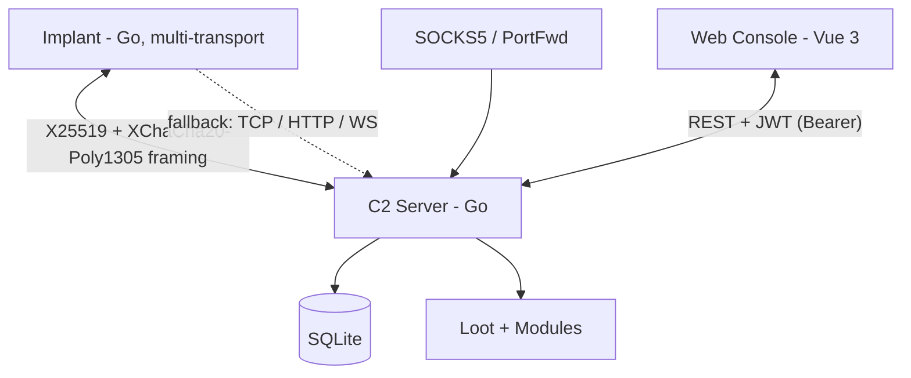

<div align="center">

# ⚡ WorldC2

### Command & Control platform for authorized security labs

[](https://golang.org/)
[](https://vuejs.org/)
[](LICENSE)
[](.github/workflows/ci.yml)
[]()


</div>

---

## ⚠️ Authorized use only

WorldC2 is a **red-team tooling project built for learning and demonstration**. It is intended for
use in environments you own or are explicitly authorized to test (CTF labs, home labs, engagements
with a signed scope). Unauthorized use against systems you do not own is illegal.

This project is published as a **portfolio piece**: it shows how a modern C2 is architected in Go —
encrypted transports, session management, RBAC, audit logging and a real-time operator console.

---

## ✨ What it actually does

| Feature | Status | Notes |
|---------|--------|-------|
| 🔐 Encrypted C2 channel | ✅ Working | X25519 key exchange + XChaCha20-Poly1305 (AEAD) per session |
| 📡 Multi-transport listeners | ✅ Working | TCP+TLS, HTTP long-poll, WebSocket |
| 🖥️ Operator web console | ✅ Working | Vue 3 + Vite, dark minimalist UI, live polling |
| 🧩 REST API + JWT auth | ✅ Working | Access + refresh tokens (`token_use` claims), bcrypt operators |
| 👥 RBAC | ✅ Working | `admin` / `operator` / `viewer` / `auditor` roles, per-endpoint permissions |
| 📜 Audit log | ✅ Working | Actions stored in SQLite, SIEM forwarding hook |
| 🔌 Modular task system | ✅ Working | Protobuf envelopes, dynamic module push; manifests HMAC-signed on registration and re-verified before every push (tampered manifests rejected) |
| 📁 Loot storage | ✅ Working | Session-scoped file storage with traversal protection |
| 🌐 SOCKS5 / port-forward tunnels | ✅ Working | TCP relaying through agents |
| 🗄️ SQLite storage | ✅ Working | Transactional migrations; optional AES-256-GCM at-rest encryption for secrets (`WORLDC2_MASTER_KEY`) |
| 🐳 Docker packaging | ✅ Working | Multi-stage build, non-root runtime user, healthcheck |
| 🔄 DNS transport | 🧪 Experimental | Listener exists, not integrated with agent fallback chain |
| 🕸️ WebRTC (Pion) | 📋 Planned | Not implemented — removed from docs until it is real |
| 📈 File exfil resume | 📋 Planned | Not implemented |

> **Honesty policy:** this README only claims what the code does. Features that are planned or
> experimental are marked as such — see the [CHANGELOG](CHANGELOG.md) for history.

---

## 📸 Console

| Login | Dashboard |
|-------|-----------|
|  |  |

| Sessions | Command Runner |
|----------|----------------|
|  |  |

| Modules | Files |
|---------|-------|
|  |  |

---

## 🏗️ Architecture


```mermaid
graph TB
    Agent[Implant - Go, multi-transport]
    Server[C2 Server - Go]
    Proxy[SOCKS5 / PortFwd]
    UI[Web Console - Vue 3]
    DB[(SQLite)]
    Loot[Loot + Modules]

    Agent <-->|"X25519 + XChaCha20-Poly1305 framing"| Server
    Agent -.->|"fallback: TCP / HTTP / WS"| Server
    Proxy --> Server
    UI <-->|"REST + JWT (Bearer)"| Server
    Server --> DB
    Server --> Loot
```

**Crypto:** every session runs an ephemeral X25519 agreement; HKDF-SHA256 derives the encryption
key, an HMAC key and a session token; traffic is framed as protobuf envelopes encrypted with
XChaCha20-Poly1305 (192-bit nonces). The API layer is separate: bcrypt-hashed operators, JWT access
tokens (12h) + refresh tokens (24h, `token_use=refresh`, rejected by API routes), and RBAC checks
per endpoint.

---

## 🚀 Quick start

```bash
git clone https://github.com/Ruby570bocadito/WorldC2.git
cd WorldC2

# Build the server (Go 1.25+)
cd src/go && go build -o ../../dist/worldc2-server ./cmd/server && cd ../..

# Build the web console (Node 18+)
cd web && npm ci && npm run build && cd ../..

# Configure
cp config.example.yaml config.yaml
#   → default example hash is 'admin': CHANGE IT before any real use
#   → or remove the operators block and a random bootstrap password is printed once

# Run — the console is served on the API port automatically
./dist/worldc2-server -config config.yaml
# Dashboard:  http://localhost:9090
# Health:     http://localhost:9090/api/health
```

### Docker

```bash
docker compose up --build      # or: docker build -t worldc2-server .
```

### Agents

```bash
cd src/go
go build -o ../../dist/worldc2-agent ./cmd/agent
./dist/worldc2-agent --server 127.0.0.1:8443
```

---

## 🔧 Development

```bash
make test          # Go tests with race detector
make lint          # go vet
make web           # build frontend
make build-agent-all  # cross-compile agents
make test-all      # Go + Python + frontend pipeline
```

CI runs on every push: Go tests (`-race`), vet, gofmt, Python syntax checks, a live API smoke test
against a real server instance, frontend build with XSS-sink checks, multi-platform builds and a
Docker smoke test.

---

## 📦 Project layout

```
WorldC2/
├── src/go/               # Go workspace
│   ├── cmd/server        #   C2 server entrypoint
│   ├── cmd/agent         #   implant entrypoint
│   ├── cmd/builder       #   payload builder helper
│   └── internal/         #   c2, session, crypto, auth, db, handlers, module, transport...
├── web/                  # Vue 3 + Vite operator console
├── api/openapi.yaml      # REST API spec
├── modules/              # dynamic module manifests
├── scripts/              # operator tooling (deploy, certs, hardening audit, console client)
├── tests/                # API functional / e2e / pentest self-tests
├── docs/assets/          # screenshots & demo GIF
└── Makefile
```

---

## 🔒 Security notes

- Operators are stored as bcrypt hashes; the example config ships the hash of `admin` — change it.
- TLS: `auto_cert: true` generates a self-signed cert; point `cert_file`/`key_file` at your own
  cert for real deployments. If TLS is enabled but misconfigured, **the server refuses to start**
  instead of falling back to plaintext.
- Agents pin the server certificate on first connect (TOFU) and reject changes afterwards.
- Optional mutual TLS: set `tls.mtls: true`, issue a client certificate
  (`POST /api/mtls/cert`, admin) and start the agent with `worldc2-agent -tls-cert agent.crt -tls-key agent.key`.
  The CA is persisted across restarts, so issued certificates stay valid.
- Every API request is rate-limited, size-limited and audited; refresh tokens cannot be used as
  access tokens.
- Sensitive vault columns can be encrypted at rest with AES-256-GCM by setting `WORLDC2_MASTER_KEY`.
- Module manifests are HMAC-signed when registered through the API and re-verified before every
  push — tampered manifests are rejected at load and pack time; module paths are sanitized against
  traversal.

---

## 🤝 Contributing

PRs are welcome — bug fixes, tests and docs first. Please keep the honesty policy: do not document
features that don't exist.

1. Fork the repo
2. `git checkout -b feat/amazing`
3. `make test-all` must pass
4. Open a PR

---

## 📄 License

MIT — see [LICENSE](LICENSE).

<div align="center">

**WorldC2** — built for the lab, documented honestly.

[Report a bug](https://github.com/Ruby570bocadito/WorldC2/issues) ·
[Request a feature](https://github.com/Ruby570bocadito/WorldC2/issues)

</div>
